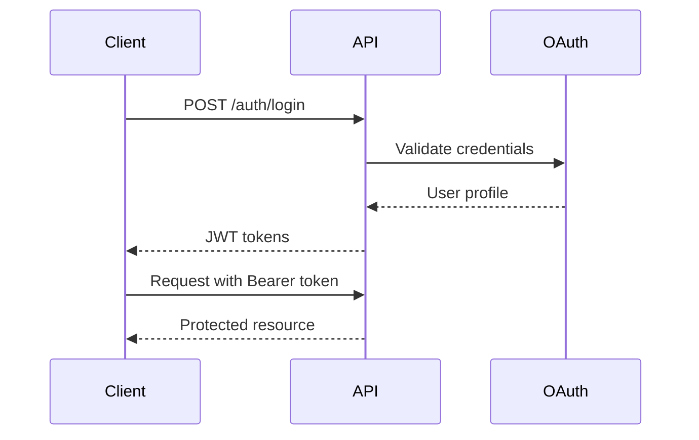

# Roo-Code API Specification

## Overview

This document provides the complete API specification for the Roo-Code service, covering all endpoints, data models, authentication, and integration patterns.

## Base URL

- **Production**: `https://api.roocode.com`
- **Staging**: `https://staging-api.roocode.com`
- **Development**: `http://localhost:3000`

## Authentication

### Authentication Methods

1. **JWT Tokens** (Primary)
2. **OAuth2** (Google, GitHub, Microsoft)
3. **API Keys** (Programmatic access)

### Headers

```http
Authorization: Bearer <jwt_token>
Content-Type: application/json
X-API-Version: v1
```

### Authentication Flow



## Core Data Models

### User
```typescript
interface User {
  id: string;
  email: string;
  name: string;
  provider: 'local' | 'google' | 'github' | 'microsoft';
  roles: Role[];
  preferences: UserPreferences;
  createdAt: string;
  lastLoginAt: string;
}

interface UserPreferences {
  theme: 'light' | 'dark' | 'auto';
  language: string;
  notifications: NotificationSettings;
  defaultProvider: string;
  defaultModel: string;
}
```

### Session
```typescript
interface Session {
  id: string;
  userId: string;
  name: string;
  workspaceId: string;
  config: SessionConfig;
  status: 'active' | 'inactive' | 'archived';
  createdAt: string;
  updatedAt: string;
  expiresAt?: string;
}

interface SessionConfig {
  provider: string;
  model: string;
  mode: string;
  maxTokens?: number;
  temperature?: number;
  allowedCommands: string[];
  resourceLimits: ResourceLimits;
}
```

### Task
```typescript
interface Task {
  id: string;
  sessionId: string;
  input: string;
  images?: string[];
  status: 'pending' | 'running' | 'completed' | 'failed' | 'cancelled';
  progress: number;
  result?: TaskResult;
  error?: TaskError;
  createdAt: string;
  startedAt?: string;
  completedAt?: string;
  estimatedDuration?: number;
}

interface TaskResult {
  summary: string;
  filesCreated: string[];
  filesModified: string[];
  commandsExecuted: string[];
  toolsUsed: string[];
}
```

## API Endpoints

### Authentication Endpoints

#### POST /api/v1/auth/login
Authenticate user with email/password.

**Request:**
```json
{
  "email": "user@example.com",
  "password": "password123"
}
```

**Response:**
```json
{
  "user": { /* User object */ },
  "tokens": {
    "accessToken": "jwt_token",
    "refreshToken": "refresh_token",
    "expiresIn": 3600
  }
}
```

#### POST /api/v1/auth/oauth/{provider}
Authenticate via OAuth provider.

**Parameters:**
- `provider`: google | github | microsoft

**Request:**
```json
{
  "code": "oauth_authorization_code",
  "redirectUri": "https://app.roocode.com/callback"
}
```

#### POST /api/v1/auth/refresh
Refresh access token.

**Request:**
```json
{
  "refreshToken": "refresh_token"
}
```

#### GET /api/v1/auth/profile
Get current user profile.

**Response:**
```json
{
  "user": { /* User object */ }
}
```

### Session Management

#### GET /api/v1/sessions
List user sessions.

**Query Parameters:**
- `status`: active | inactive | archived
- `limit`: number (default: 20, max: 100)
- `offset`: number (default: 0)

**Response:**
```json
{
  "sessions": [/* Session objects */],
  "total": 42,
  "hasMore": true
}
```

#### POST /api/v1/sessions
Create new session.

**Request:**
```json
{
  "name": "My Project Session",
  "config": {
    "provider": "anthropic",
    "model": "claude-3-sonnet",
    "mode": "code",
    "allowedCommands": ["npm", "git", "ls"],
    "resourceLimits": {
      "maxMemoryMB": 512,
      "maxCpuPercent": 50,
      "maxDiskMB": 1024,
      "maxExecutionTime": 300
    }
  }
}
```

**Response:**
```json
{
  "session": { /* Session object */ },
  "workspace": {
    "path": "/workspaces/session-123",
    "url": "https://files.roocode.com/session-123"
  }
}
```

#### GET /api/v1/sessions/{sessionId}
Get session details.

#### PUT /api/v1/sessions/{sessionId}
Update session configuration.

#### DELETE /api/v1/sessions/{sessionId}
Delete session and cleanup workspace.

### Task Management

#### POST /api/v1/sessions/{sessionId}/tasks
Create and execute new task.

**Request:**
```json
{
  "input": "Create a React component for user authentication",
  "images": ["data:image/png;base64,..."],
  "config": {
    "enableDiff": true,
    "enableCheckpoints": true,
    "maxIterations": 10
  }
}
```

**Response:**
```json
{
  "task": { /* Task object */ },
  "websocket": "wss://api.roocode.com/ws/session-123"
}
```

#### GET /api/v1/sessions/{sessionId}/tasks
List session tasks.

#### GET /api/v1/sessions/{sessionId}/tasks/{taskId}
Get task details and status.

#### PUT /api/v1/sessions/{sessionId}/tasks/{taskId}
Update task (approve/reject actions).

**Request:**
```json
{
  "action": "approve" | "reject",
  "feedback": "Optional feedback message"
}
```

#### DELETE /api/v1/sessions/{sessionId}/tasks/{taskId}
Cancel running task.

### File Operations

#### GET /api/v1/sessions/{sessionId}/files
List workspace files.

**Query Parameters:**
- `path`: string (directory path)
- `recursive`: boolean
- `includeHidden`: boolean

**Response:**
```json
{
  "files": [
    {
      "name": "component.tsx",
      "path": "/src/component.tsx",
      "type": "file",
      "size": 1024,
      "modifiedAt": "2024-01-15T10:30:00Z"
    }
  ],
  "directories": [
    {
      "name": "src",
      "path": "/src",
      "type": "directory",
      "childCount": 5
    }
  ]
}
```

#### GET /api/v1/sessions/{sessionId}/files/*
Read file content.

**Response:**
```json
{
  "content": "file content",
  "encoding": "utf-8",
  "size": 1024,
  "modifiedAt": "2024-01-15T10:30:00Z"
}
```

#### POST /api/v1/sessions/{sessionId}/files/*
Create new file.

**Request:**
```json
{
  "content": "file content",
  "encoding": "utf-8"
}
```

#### PUT /api/v1/sessions/{sessionId}/files/*
Update file content.

#### DELETE /api/v1/sessions/{sessionId}/files/*
Delete file.

### Tool Execution

#### GET /api/v1/tools
List available tools.

**Response:**
```json
{
  "tools": [
    {
      "name": "read_file",
      "description": "Read file content",
      "parameters": {
        "path": {
          "type": "string",
          "description": "File path",
          "required": true
        }
      }
    }
  ]
}
```

#### POST /api/v1/sessions/{sessionId}/tools/{toolName}
Execute tool directly.

**Request:**
```json
{
  "parameters": {
    "path": "/src/component.tsx"
  }
}
```

**Response:**
```json
{
  "result": {
    "success": true,
    "output": "tool execution result",
    "filesChanged": ["/src/component.tsx"]
  },
  "executionTime": 150,
  "resourceUsage": {
    "memory": 45,
    "cpu": 12
  }
}
```

## WebSocket Events

### Connection
```javascript
const socket = io('wss://api.roocode.com', {
  auth: {
    token: 'jwt_token',
    sessionId: 'session-123'
  }
});
```

### Event Types

#### Task Events
```javascript
// Task started
socket.on('task.started', (data) => {
  console.log('Task started:', data.taskId);
});

// Task progress
socket.on('task.progress', (data) => {
  console.log('Progress:', data.progress, data.step);
});

// Task completed
socket.on('task.completed', (data) => {
  console.log('Task completed:', data.result);
});

// Task failed
socket.on('task.failed', (data) => {
  console.log('Task failed:', data.error);
});
```

#### Tool Events
```javascript
// Tool execution started
socket.on('tool.started', (data) => {
  console.log('Tool:', data.toolName, 'Parameters:', data.parameters);
});

// Tool execution completed
socket.on('tool.completed', (data) => {
  console.log('Tool result:', data.result);
});
```

#### Approval Events
```javascript
// Approval required
socket.on('approval.required', (data) => {
  console.log('Approval needed:', data.action, data.description);
});
```

#### File Events
```javascript
// File created
socket.on('file.created', (data) => {
  console.log('File created:', data.path);
});

// File modified
socket.on('file.modified', (data) => {
  console.log('File modified:', data.path, data.changes);
});
```

## Error Handling

### HTTP Status Codes

| Code | Meaning | Description |
|------|---------|-------------|
| 200 | OK | Request successful |
| 201 | Created | Resource created |
| 400 | Bad Request | Invalid request data |
| 401 | Unauthorized | Authentication required |
| 403 | Forbidden | Access denied |
| 404 | Not Found | Resource not found |
| 409 | Conflict | Resource conflict |
| 429 | Rate Limited | Too many requests |
| 500 | Server Error | Internal server error |

### Error Response Format
```json
{
  "error": {
    "code": "VALIDATION_ERROR",
    "message": "Invalid request data",
    "details": {
      "field": "email",
      "reason": "Invalid email format"
    },
    "timestamp": "2024-01-15T10:30:00Z",
    "requestId": "req-123"
  }
}
```

### Common Error Codes

| Code | Description |
|------|-------------|
| `AUTHENTICATION_FAILED` | Invalid credentials |
| `TOKEN_EXPIRED` | JWT token expired |
| `VALIDATION_ERROR` | Request validation failed |
| `RESOURCE_NOT_FOUND` | Resource doesn't exist |
| `PERMISSION_DENIED` | Insufficient permissions |
| `RATE_LIMIT_EXCEEDED` | Too many requests |
| `WORKSPACE_LIMIT_EXCEEDED` | Resource limits exceeded |
| `TOOL_EXECUTION_FAILED` | Tool execution error |

## Rate Limiting

### Limits by Endpoint Type

| Endpoint Type | Limit | Window |
|---------------|--------|--------|
| Authentication | 5 requests | 1 minute |
| Session Management | 50 requests | 1 minute |
| Task Creation | 5 requests | 1 minute |
| File Operations | 100 requests | 1 minute |
| Tool Execution | 20 requests | 1 minute |

### Rate Limit Headers
```http
X-RateLimit-Limit: 100
X-RateLimit-Remaining: 85
X-RateLimit-Reset: 1642248600
```

## Pagination

### Request Parameters
```http
GET /api/v1/sessions?limit=20&offset=40
```

### Response Format
```json
{
  "data": [/* items */],
  "pagination": {
    "total": 150,
    "limit": 20,
    "offset": 40,
    "hasMore": true,
    "nextOffset": 60
  }
}
```

## Webhooks

### Configuration
```json
{
  "url": "https://your-app.com/webhooks/roocode",
  "secret": "webhook_secret",
  "events": ["task.completed", "task.failed"]
}
```

### Payload
```json
{
  "event": "task.completed",
  "timestamp": "2024-01-15T10:30:00Z",
  "data": {
    "sessionId": "session-123",
    "taskId": "task-456",
    "result": { /* task result */ }
  }
}
```

## SDK Examples

### JavaScript/TypeScript
```typescript
import { RooCodeClient } from '@roocode/sdk';

const client = new RooCodeClient({
  apiKey: 'your-api-key',
  baseURL: 'https://api.roocode.com'
});

// Create session
const session = await client.sessions.create({
  name: 'My Project',
  config: {
    provider: 'anthropic',
    model: 'claude-3-sonnet',
    mode: 'code'
  }
});

// Execute task
const task = await client.tasks.create(session.id, {
  input: 'Create a React component',
  onProgress: (progress) => console.log('Progress:', progress),
  onComplete: (result) => console.log('Result:', result)
});
```

### Python
```python
from roocode import RooCodeClient

client = RooCodeClient(api_key='your-api-key')

# Create session
session = client.sessions.create(
    name='My Project',
    config={
        'provider': 'anthropic',
        'model': 'claude-3-sonnet',
        'mode': 'code'
    }
)

# Execute task
task = client.tasks.create(
    session_id=session.id,
    input='Create a React component'
)
```

### cURL Examples
```bash
# Authenticate
curl -X POST https://api.roocode.com/api/v1/auth/login \
  -H "Content-Type: application/json" \
  -d '{"email":"user@example.com","password":"password"}'

# Create session
curl -X POST https://api.roocode.com/api/v1/sessions \
  -H "Authorization: Bearer $TOKEN" \
  -H "Content-Type: application/json" \
  -d '{"name":"My Project","config":{"provider":"anthropic","model":"claude-3-sonnet"}}'

# Execute task
curl -X POST https://api.roocode.com/api/v1/sessions/session-123/tasks \
  -H "Authorization: Bearer $TOKEN" \
  -H "Content-Type: application/json" \
  -d '{"input":"Create a React component"}'
```

## Testing

### API Testing
```javascript
// Jest + Supertest example
describe('Sessions API', () => {
  test('should create session', async () => {
    const response = await request(app)
      .post('/api/v1/sessions')
      .set('Authorization', `Bearer ${token}`)
      .send({
        name: 'Test Session',
        config: { provider: 'anthropic', model: 'claude-3-sonnet' }
      })
      .expect(201);
    
    expect(response.body.session.id).toBeDefined();
  });
});
```

### WebSocket Testing
```javascript
// Socket.IO testing
test('should receive task progress events', (done) => {
  const client = io('http://localhost:3000', {
    auth: { token: testToken, sessionId: testSession.id }
  });
  
  client.on('task.progress', (data) => {
    expect(data.progress).toBeGreaterThan(0);
    done();
  });
  
  // Trigger task
  client.emit('task.create', { input: 'test task' });
});
```

## Security

### Input Validation
- All inputs validated with JSON Schema
- File paths sanitized to prevent directory traversal
- Command injection prevention
- SQL injection protection

### Authentication Security
- JWT tokens with short expiration
- Refresh token rotation
- Rate limiting on auth endpoints
- Account lockout after failed attempts

### Workspace Security
- Isolated file system per session
- Network access restrictions
- Resource limits enforcement
- Process sandboxing

---

**This API specification provides complete coverage of all Roo-Code functionality accessible via HTTP REST API and WebSocket connections.** 