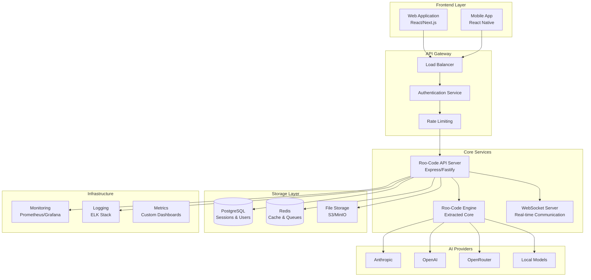
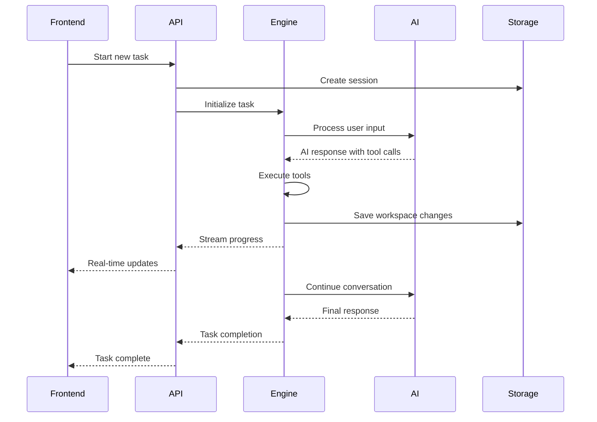

# System Architecture Overview

## High-Level Architecture

## Component Breakdown

### 1. Frontend Layer

#### Web Application (React/Next.js)
- **Purpose**: Primary user interface for desktop/web users
- **Features**:
  - Real-time chat interface
  - File explorer and editor
  - Terminal interface
  - Browser automation controls
  - Task management dashboard
  - Settings and configuration
  - Mode switching interface

#### Mobile Application (React Native) - Future Phase
- **Purpose**: Mobile access to Roo-Code functionality
- **Features**:
  - Simplified chat interface
  - File viewing and basic editing
  - Task monitoring
  - Push notifications

### 2. API Gateway

#### Load Balancer
- **Technology**: HAProxy/NGINX
- **Purpose**: Distribute traffic across API instances
- **Features**: Health checks, SSL termination, session affinity

#### Authentication Service
- **Technology**: JWT + OAuth2
- **Purpose**: User authentication and authorization
- **Features**: Multi-provider auth, API key management, role-based access

#### Rate Limiting
- **Technology**: Redis-based rate limiting
- **Purpose**: Prevent abuse and ensure fair usage
- **Features**: Per-user limits, API key-based limits, burst handling

### 3. Core Services

#### Roo-Code API Server
- **Technology**: Express.js/Fastify with TypeScript
- **Purpose**: HTTP API for all Roo-Code functionality
- **Endpoints**:
  - Session management
  - Task execution
  - File operations
  - Configuration management
  - Real-time communication

#### Roo-Code Engine
- **Technology**: Extracted core from VS Code extension
- **Purpose**: Core AI agent functionality
- **Components**:
  - Task management system
  - Tool execution engine
  - AI provider integration
  - Context management
  - Mode system

#### WebSocket Server
- **Technology**: Socket.IO/native WebSockets
- **Purpose**: Real-time communication for streaming responses
- **Features**: Task progress updates, live tool execution, approval requests

### 4. Storage Layer

#### PostgreSQL Database
- **Purpose**: Persistent data storage
- **Schema**:
  - Users and authentication
  - Sessions and workspaces
  - Task history
  - Configuration profiles
  - Usage analytics

#### Redis Cache
- **Purpose**: Caching and temporary data
- **Usage**:
  - Session state
  - Task queues
  - Rate limiting counters
  - Real-time messaging

#### File Storage (S3/MinIO)
- **Purpose**: Workspace file storage
- **Features**:
  - Isolated workspaces per user/session
  - Version control integration
  - Backup and restore
  - Large file handling

## Data Flow Architecture

## Security Architecture

### Authentication & Authorization
- **JWT Tokens**: Stateless authentication with refresh tokens
- **OAuth2 Integration**: Google, GitHub, Microsoft providers
- **API Keys**: For programmatic access
- **Role-Based Access Control**: Admin, user, readonly roles

### Workspace Isolation
- **Containerization**: Each session runs in isolated container
- **File System Sandboxing**: Restricted file access per workspace
- **Network Isolation**: Controlled external access
- **Resource Limits**: CPU, memory, storage quotas

### Data Protection
- **Encryption at Rest**: Database and file storage encryption
- **Encryption in Transit**: TLS 1.3 for all communications
- **Audit Logging**: All actions logged with user context
- **Data Retention**: Configurable workspace cleanup policies

## Scalability Considerations

### Horizontal Scaling
- **Stateless API Servers**: Multiple API instances behind load balancer
- **Database Sharding**: Horizontal database scaling by user/workspace
- **Task Queue Distribution**: Redis-based task distribution
- **CDN Integration**: Static asset and file delivery

### Performance Optimization
- **Caching Strategy**: Multi-layer caching (Redis, CDN, browser)
- **Database Optimization**: Query optimization, connection pooling
- **Async Processing**: Background task processing
- **Streaming Responses**: Real-time updates for long-running tasks

### Resource Management
- **Auto-scaling**: Container orchestration with Kubernetes
- **Resource Monitoring**: CPU, memory, storage tracking
- **Queue Management**: Priority-based task scheduling
- **Graceful Degradation**: Fallback for high-load scenarios

## Technology Stack Summary

| Layer | Technology | Purpose |
|-------|------------|---------|
| Frontend | React/Next.js, TypeScript | Web application |
| API | Express.js/Fastify, TypeScript | REST API and WebSocket |
| Engine | Node.js, TypeScript | Core Roo-Code logic |
| Database | PostgreSQL | Persistent data |
| Cache | Redis | Session state, queues |
| Storage | S3/MinIO | File storage |
| Containers | Docker | Service isolation |
| Orchestration | Kubernetes | Container management |
| Monitoring | Prometheus, Grafana | System monitoring |
| Logging | ELK Stack | Log aggregation |

## Migration Strategy

### Phase 1: Core Extraction
1. Extract core engine from VS Code extension
2. Remove VS Code dependencies
3. Create standalone service interface
4. Implement basic HTTP API

### Phase 2: API Enhancement
1. Add authentication and authorization
2. Implement WebSocket communication
3. Add workspace management
4. Create production-ready deployment

### Phase 3: Frontend Development
1. Build React application
2. Implement real-time communication
3. Create comprehensive UI for all tools
4. Add responsive design

### Phase 4: Production Hardening
1. Implement monitoring and logging
2. Add security measures
3. Performance optimization
4. Scaling infrastructure

## Development Environment

### Local Development
- **Docker Compose**: Complete local stack
- **Hot Reload**: Frontend and API development
- **Mock Services**: External API mocking
- **Debug Tools**: Comprehensive debugging setup

### CI/CD Pipeline
- **Build**: Automated builds on push
- **Test**: Unit, integration, E2E testing
- **Security**: Vulnerability scanning
- **Deploy**: Automated deployment to environments

---

*This architecture provides a scalable, secure, and maintainable foundation for deploying Roo-Code as a service while maintaining all of its powerful capabilities.* 